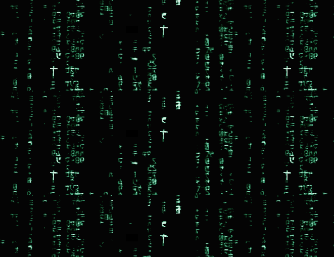

    

       <a href="https://github.com/GSappio">
        

    

   
      
     

 
 

 

  
 

  
  
 

 

 
   ㅤ
  
  
  
  
  
  
  
    ㅤㅤㅤㅤㅤㅤㅤㅤㅤㅤㅤㅤㅤㅤㅤㅤㅤㅤㅤ
  

    
  

                                                           

 ㅤㅤㅤㅤㅤㅤㅤㅤ

   
    
     
